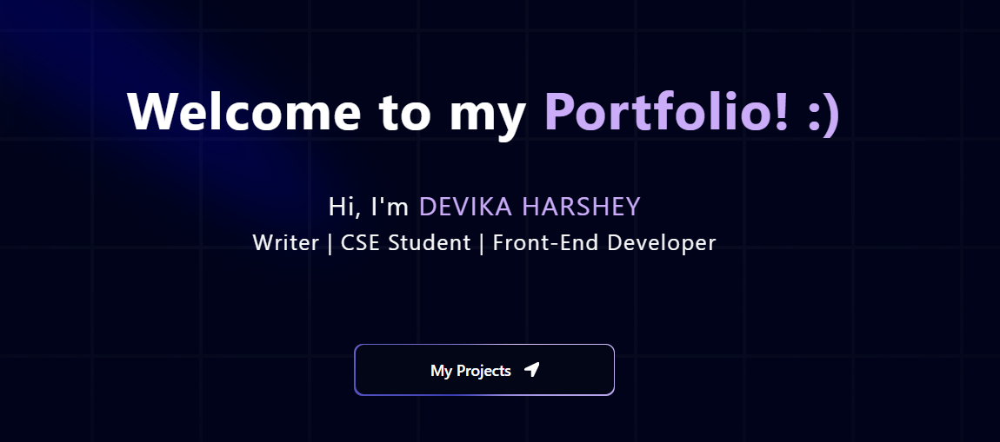

# My Portfolio

  <h3>Welcome to My Portfolio website! :) Click here to view the websie 👇</h3>
  

 
  <h3>Project Description:</h3>
  
This is my portfolio website built using frontend technologies like Next.js, Three.js, Framer 
  Motion & Tailwind CSS.It consists of 6 sections: "Home", "About", "Projects", "My Books", "My CV" & "Contact". It is a dynamic portfolio website which is responsive, interactive and has a captivating UI.

 
  <h3>Tech Stack & Languages:</h3> 
  <h4>Front-end:</h4> 
  
  
  
  
  
  
  <h4>Language:</h4> 
  
  
